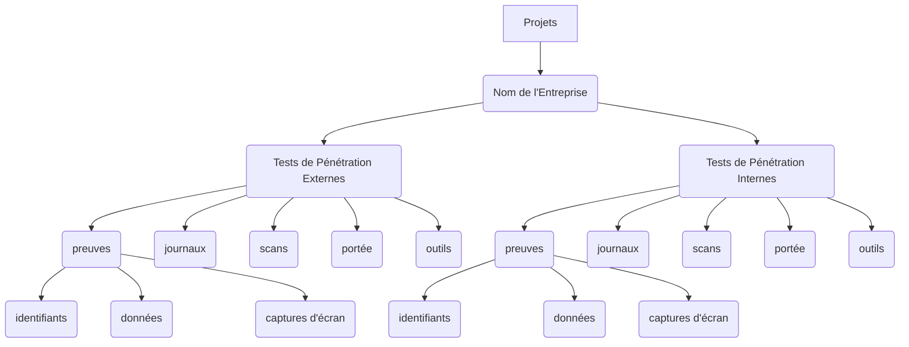

# 1/ Organisation Des dossiers 

```mermaid 
graph TD 

A[Projets] --> B(Nom de l'Entreprise )
    B --> C(Tests de Pénétration Externes)
    C --> C1(preuves)
    C1 --> C1a(identifiants)
    C1 --> C1b(données)
    C1 --> C1c(captures d'écran)
    C --> C2(journaux)
    C --> C3(scans)
    C --> C4(portée)
    C --> C5(outils)
    B --> D(Tests de Pénétration Internes)
    D --> D1(preuves)
    D1 --> D1a(identifiants)
    D1 --> D1b(données)
    D1 --> D1c(captures d'écran)
    D --> D2(journaux)
    D --> D3(scans)
    D --> D4(portée)
    D --> D5(outils)
```

# 2/ Importance VPN

